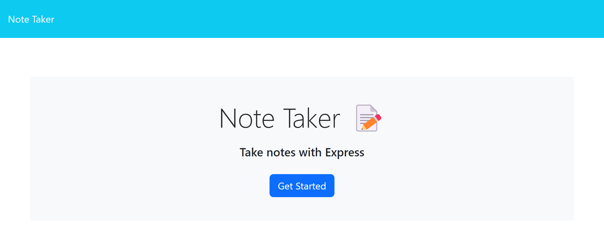
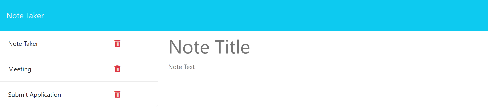

# JN-Note-Taker

## Description

Through this challenge, I was able to create an application that helps users write and save notes. The app uses Express.js in order to save and retrieve note data from a JSON file. The project was completed by following the acceptance criterias listed below:

```
GIVEN a note-taking application
WHEN I open the Note Taker
THEN I am presented with a landing page with a link to a notes page
WHEN I click on the link to the notes page
THEN I am presented with a page with existing notes listed in the left-hand column, plus empty fields to enter a new note title and the note’s text in the right-hand column
WHEN I enter a new note title and the note’s text
THEN a "Save Note" button and a "Clear Form" button appear in the navigation at the top of the page
WHEN I click on the Save button
THEN the new note I have entered is saved and appears in the left-hand column with the other existing notes and the buttons in the navigation disappear
WHEN I click on an existing note in the list in the left-hand column
THEN that note appears in the right-hand column and a "New Note" button appears in the navigation
WHEN I click on the "New Note" button in the navigation at the top of the page
THEN I am presented with empty fields to enter a new note title and the note’s text in the right-hand column and the button disappears
```

This projected was created with Node.js, Express.js, and UUID. Insomnia was used to help test the application on the back end. There was starter code provided for this challenge.


## Installation

For this application you will need the following:

- Visual Studio Code <br>
- Node.js <br>
- Install the dependencies by running the following code: ```npm i``` <br>


## Usage 

Once you have all the files in VS Code, you will need to install the dependencies. You will need to run ```nodemon server.js``` into your integrated terminal; this will run the app on the local host!

You can also test the application on the deployed page. You can see how the deployed app appears below:





## Credits

Thank you Andrew B., Chris B., and Michael H. for all your help! 😊👍


## Links

[GitHub Repository](https://github.com/jkimys2/JN-Note-Taker)

[Deployed Heroku Page](https://jn-note-taker-44e454eac4d0.herokuapp.com/)